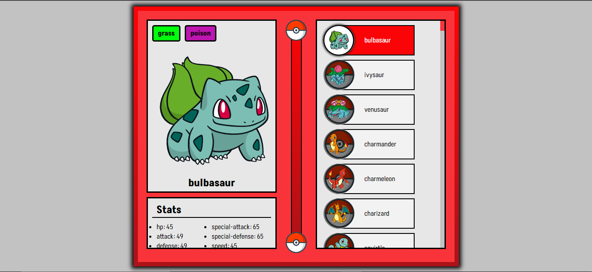

# Pokedex mapa dev week

  
  
  

Projeto desenvolvido em react consumindo a pokeAPI para adicionar conteudo ao site, foco no estudo de react e requisições a APIs 

 

## Config

 - Run `npm install` to install project depéndencies 
 - Run `npm start` to start development server
 - Run `npm run buld` to make production version of this project

## Tecnologies

 - [React](https://reactjs.org/)
 - [Css](https://developer.mozilla.org/pt-BR/docs/Web/CSS)
 - [javascript](https://developer.mozilla.org/pt-BR/docs/Web/JavaScript)

 

---

Desenvolvido Por [Alessandro Massarotti Jr](https://github.com/alessandro-massarotti-jr) 🤖